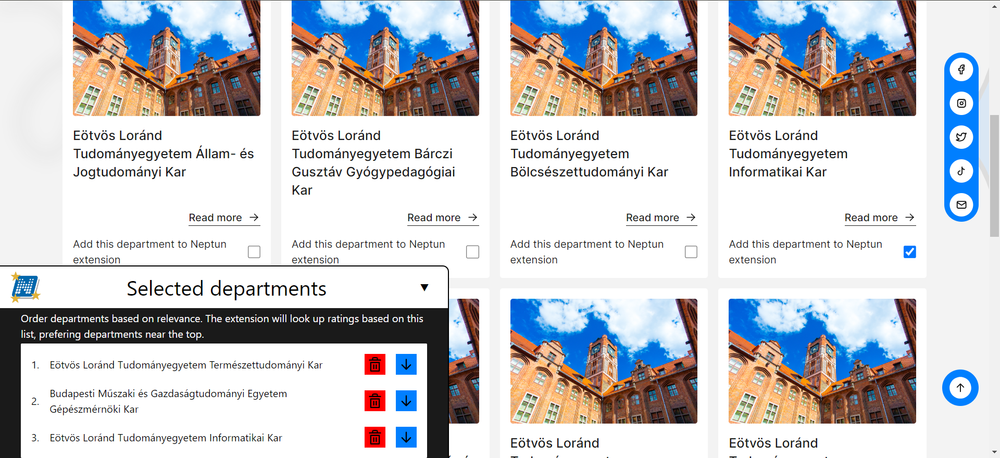

#  Neptun mark my professor ratings

Shows lecturer ratings in Neptun from [www.markmyprofessor.com](https://www.markmyprofessor.com)

The names become links to the relevant rating pages.

## Getting started

### Install

1. Download the [TamperMonkey](https://tampermonkey.net) extension for your browser

2. Download this script by clicking the _Add to tampermonkey_ badge at the top

### Setup

Unfortunately, multiple people can have the same name, which can lead to confusion and the wrong rating getting displayed. Therefore, the script needs to know the relevant universities and the relevant departments.

1. After you downloaded the script, click [here]("https://www.markmyprofessor.com/en/schools").

2. Find your school(s) and click it.

3. Select the relevant departments. The script will only look for lecturers in the selected departments (and lecturers with no departments).

4. Order the selected departments. If two lecturers from two different departments happen to have the same name, the script will know which one to prefer.

If any time you want to change the department settings, click the _Select departments_ menu under this script.

Sometimes the script finds the wrong person. If you want to make sure, click the name of the lecturer to see their rating page.
