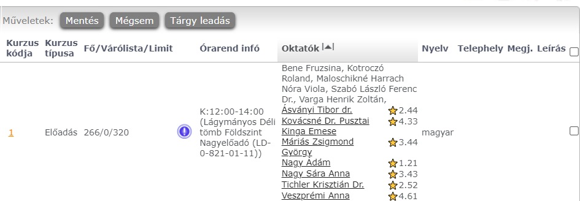

#  Neptun Mark My Professor Ratings

This script displays lecturer ratings from [Mark My Professor](https://www.markmyprofessor.com) directly in Neptun.

The lecturer names in Neptun become links to their rating pages on Mark My Professor.

> ⚠️ **Warning:** Lecturers may be listed under different names on [Mark My Professor](https://www.markmyprofessor.com). Clicking on a lecturer's name will show the rating page found. Verify the names and departments to ensure accuracy. This script may not find rating pages for all lecturers (as shown in the demo image), but this does not necessarily mean that the lecturer lacks a rating page.

> 📃 **Note:** It may take a few seconds for the ratings to appear, especially on pages with many names.

## Getting Started

### Installation

1. Install the [TamperMonkey](https://tampermonkey.net) extension for your browser.
2. Download the script by clicking [here](https://github.com/UnicodeError0041/neptun-mark-my-professor-ratings/raw/main/neptun_mark_my_professor_ratings.user.js).

### Setup

Because multiple lecturers can share the same name, the script needs to know which universities you attend to display the correct ratings.

1. After downloading the script, click [here](https://www.markmyprofessor.com/en/schools) to open the school selection page.

2. Find and select your school(s).
3. Choose the relevant departments. The script will search for lecturers only in the selected departments (and lecturers without specified departments).

4. Arrange the selected departments in order of preference. If two lecturers from different departments share the same name, the script will prioritize based on this order.

To change the department settings later, click the _Select departments_ menu under this script.

